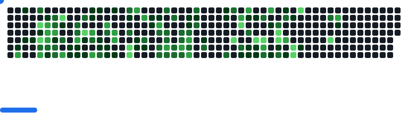

    

<h1 align="center"></h1>

##  Tech Universe

### Originium-(Core Languages) 

    

### Starlight Realm-(Frontend) 

    

### Neural Nebula-(AI & ML & DL & CV)

    

### Dark Matter Core-(Backend & RAG) 

    
    
    
    

### Galactic Memory-(Databse) 

    

### Cosmic Forge-(Dev Tools) 

### Void Intelligence-(LLMs)

  
  
  
  
  
  

## 🌌 Stellar Analytics

 
 

  

<!-- Github stats -->
   
   

 

 <!-- Top Languages Card -->
   
   

    

### Visit Repos...

  

### Nebula Network-(Let's Connect)↓

  

### Github Contribution

    <picture>
  <source
    media="(prefers-color-scheme: light)"
    srcset="images/breakout-light.svg"
  />
  

